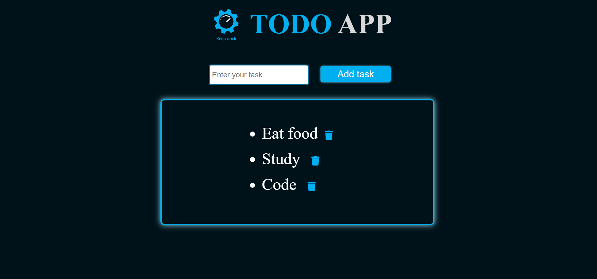

# TODO
TODO is a task tracking app, which lets you put your daily tasks to be done in an organized and maintained manner so that you can accomplish them with a grace of confidence. It has the features to add new tasks and also to delete the completed ones. It has a beautifully designed interface for better user experience.
# Awesome TODO Web App

Welcome to the Awesome TODO Web App! This web application allows you to manage your tasks and stay organized. Whether it's for work, school, or personal life, our app helps you keep track of what needs to be done.

## Features

- **Add New Tasks:** Easily add new tasks to your to-do list. Enter a task description and hit the "Add" button.

- **Delete Completed Tasks:** Once you've completed a task, simply mark it as done and then delete it from your list.

- **User-Friendly Interface:** The app features an intuitive and clean user interface, making task management a breeze.

- **Mobile Responsive:** Access your tasks on the go! The app is fully responsive and works well on various devices, including smartphones and tablets.

## Screenshots

       

 ## Check it out

[ TODO App](https://anirudhhanda.github.io/TODO/)

